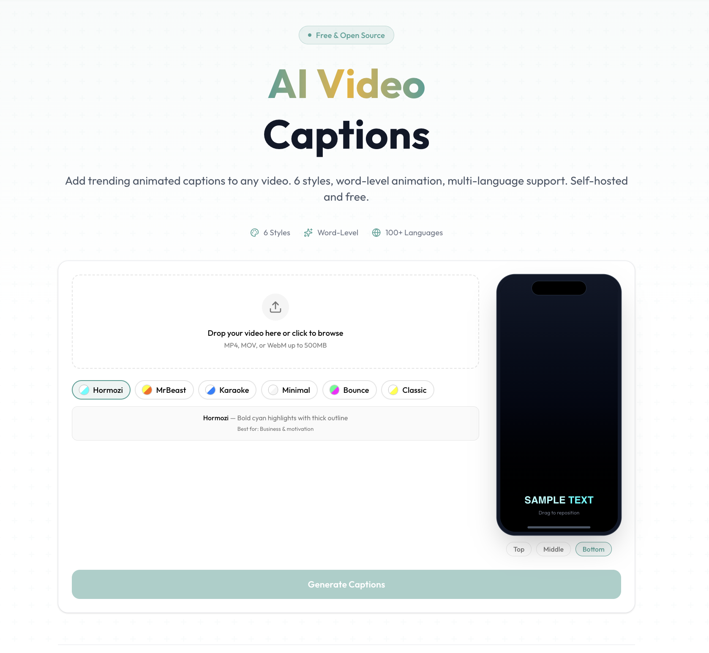
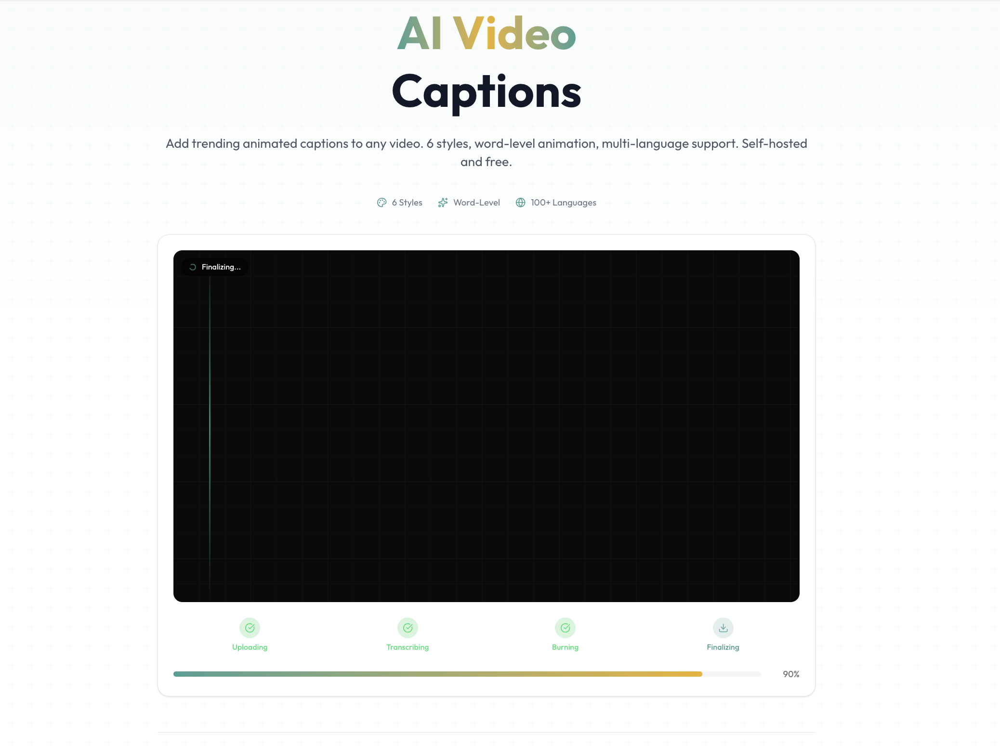
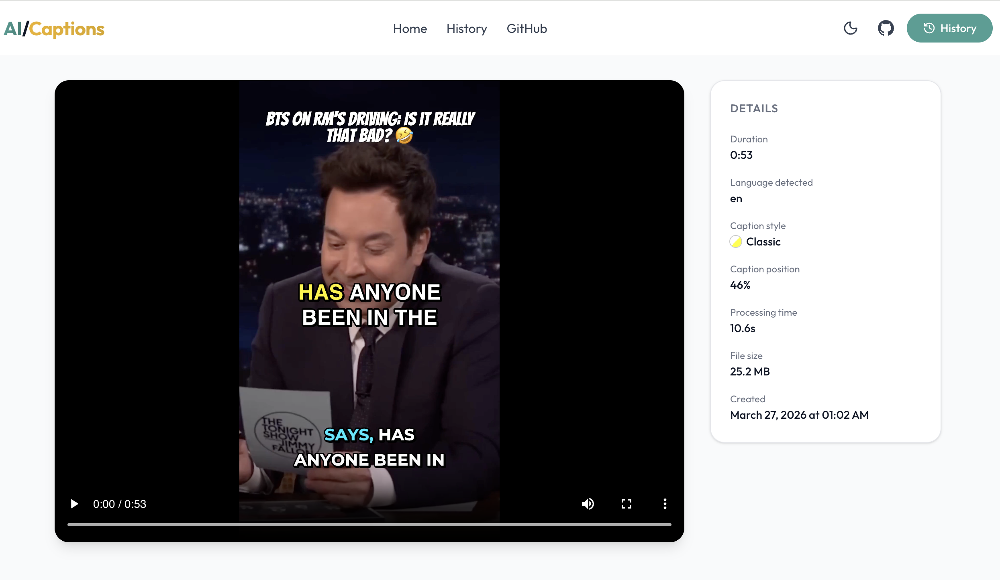
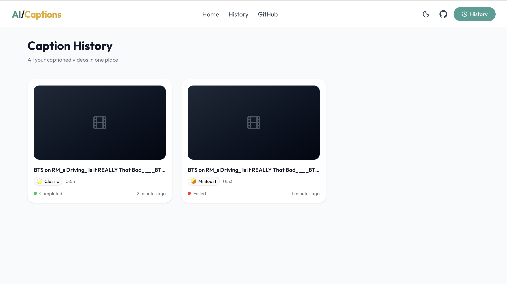

<p align="center">
  <h1 align="center">AI Video Captions</h1>
  <p align="center">
    Free, open-source AI video caption generator.<br/>
    Add trending animated subtitles to any video — 6 styles, word-level animation, 100+ languages.<br/>
    Self-hosted with Docker. No accounts, no limits.
  </p>
  <p align="center">
    <a href="https://www.autoshorts.app/en/tools/ai-caption-generator"><strong>Try the hosted version</strong></a>
  </p>
</p>

<p align="center">
  <a href="LICENSE"></a>
  <a href="docker-compose.yml"></a>
  <a href="CONTRIBUTING.md"></a>
</p>

<p align="center">
  
</p>

## What It Does

Drop in any video and AI Video Captions will:

1. **Transcribe** it using faster-whisper with word-level timestamps
2. **Generate** animated ASS subtitles in the style you chose
3. **Burn** captions directly into the video with FFmpeg
4. **Deliver** a ready-to-post captioned video in full HD

No accounts. No tracking. No limits. Self-hosted and 100% free.

## Screenshots

| Upload & Style Picker | Processing Pipeline |
|:---:|:---:|
|  |  |

| Result Viewer | Caption History |
|:---:|:---:|
|  |  |

## Features

- **6 Trending Caption Styles** — Hormozi, MrBeast, Karaoke, Minimal, Bounce, Classic — inspired by top-performing short-form content on TikTok, Reels, and Shorts
- **Word-Level Animation** — Each word animates individually with highlights, wipes, bounces, and scale effects
- **100+ Languages** — Automatic language detection with script-aware font fallback (Latin, CJK, Arabic, Devanagari, and more)
- **Live Preview** — See your chosen caption style on a phone mockup before processing
- **Adjustable Position** — Drag captions to the exact vertical position you want
- **HD Export** — CRF 18 quality with original audio preserved
- **Job History** — Browse all your captioned videos with status and metadata
- **4-Step Pipeline** — Visual progress tracking: Upload → Transcribe → Burn → Finalize

## Quick Start

### Docker (recommended)

```bash
git clone https://github.com/nicolaigaina/ai-video-captions.git
cd ai-video-captions
docker compose up
```

Open [http://localhost:3000](http://localhost:3000) and start adding captions.

### Local Development

**Prerequisites:** Python 3.11+, Node.js 20+, FFmpeg

```bash
# One-time setup
make setup

# Start both servers
make dev
```

Frontend runs on [localhost:3000](http://localhost:3000), backend on [localhost:5000](http://localhost:5000).

## Architecture

```
ai-video-captions/
├── frontend/             Next.js 16 (React 19, Tailwind CSS v4, shadcn/ui)
│   ├── src/app/          Pages: landing, history, result viewer
│   ├── src/components/   UI: dropzone, style picker, phone preview
│   ├── src/actions/      Server actions (proxy to backend API)
│   └── prisma/           SQLite schema for job metadata
│
├── backend/              Flask + faster-whisper + FFmpeg
│   ├── app.py            REST API endpoints
│   ├── caption_job.py    Processing pipeline (transcribe → subtitle → burn)
│   ├── subtitles.py      ASS subtitle generation with animations
│   └── caption_styles.py Style definitions (shared JSON config)
│
├── docker-compose.yml    Production deployment
├── docker-compose.dev.yml  Development with hot reload
└── Makefile              Dev commands
```

**How it works:**

1. The Next.js frontend uploads the video to the Flask backend via `/api/process`
2. The backend queues a job and begins processing in a background thread
3. faster-whisper transcribes the audio with word-level timestamps
4. pysubs2 generates styled ASS subtitles with per-word animations
5. FFmpeg burns the subtitles into the video at the chosen position
6. The frontend polls `/api/status/{jobId}` and shows real-time progress
7. Once complete, the user previews and downloads the captioned video

## Configuration

Copy `.env.example` to `.env` and adjust as needed:

| Variable | Default | Description |
|----------|---------|-------------|
| `WHISPER_MODEL_SIZE` | `base` | Whisper model: `tiny`, `base`, `small`, `medium`, `large-v3` |
| `MAX_FILE_SIZE_MB` | `500` | Maximum upload file size in MB |
| `MAX_DURATION_MINUTES` | `30` | Maximum video duration |
| `MAX_CONCURRENT_JOBS` | `2` | Simultaneous processing jobs |
| `OUTPUT_TTL_HOURS` | `24` | Hours to keep output files before cleanup |

Larger whisper models produce better transcriptions but require more RAM and processing time. `base` is a good default for most use cases.

## Tech Stack

| Layer | Technology |
|-------|-----------|
| Frontend | [Next.js 16](https://nextjs.org/), [React 19](https://react.dev/), TypeScript, [Tailwind CSS v4](https://tailwindcss.com/), [shadcn/ui](https://ui.shadcn.com/) |
| Backend | Python 3.11+, [Flask](https://flask.palletsprojects.com/), [faster-whisper](https://github.com/SYSTRAN/faster-whisper), [pysubs2](https://github.com/tkarabela/pysubs2) |
| Video | [FFmpeg](https://ffmpeg.org/) (subtitle burn-in, encoding) |
| Database | SQLite via [Prisma](https://www.prisma.io/) |
| Deployment | Docker Compose |

## API

Full API documentation is available in [docs/API.md](docs/API.md).

| Method | Endpoint | Description |
|--------|----------|-------------|
| `GET` | `/api/health` | Health check |
| `POST` | `/api/process` | Upload video and start captioning |
| `GET` | `/api/status/{jobId}` | Poll job progress |
| `GET` | `/api/download/{jobId}` | Download captioned video |
| `DELETE` | `/api/jobs/{jobId}` | Delete a job and its files |

## Development

```bash
make dev              # Start frontend + backend
make dev-docker       # Start with Docker (hot reload)
make test             # Run backend tests
make lint             # Lint frontend + backend
make clean            # Remove build artifacts and temp files
```

See [CONTRIBUTING.md](CONTRIBUTING.md) for full development setup and guidelines.

## License

[MIT](LICENSE)

---

Built by [@nicolaigaina](https://github.com/nicolaigaina) — creator of [AutoShorts](https://autoshorts.app), AI-powered video repurposing for content creators.

[Try AI Video Captions online](https://www.autoshorts.app/en/tools/ai-caption-generator) — no installation required.
